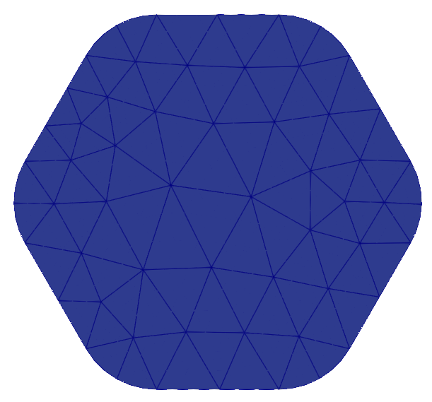
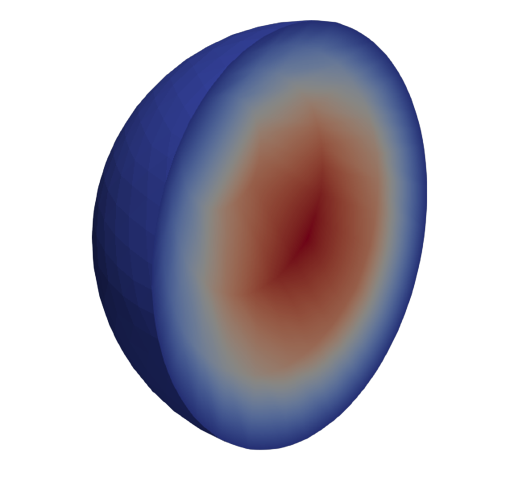
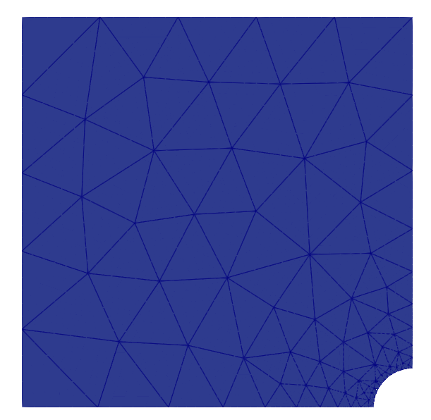

High-order meshes 
==================

This tutorial is an improved version of the Netgen tutorial available in the Firedrake documentation, which can be found `here <https://www.firedrakeproject.org/demos/netgen_mesh.py.html>`__.
It is possible to construct high-order meshes for a geometry constructed in Netgen.
In order to do so we need to use the `curve_field` method of a Firedrake `Mesh` object generated from a Netgen mesh.
In particular, we need to pass the degree of the polynomial field we want to use to parametrise the coordinates of the domain to the `curve_field` method, which will return a `Function` constructed on a DG space for this purpose. ::

   from firedrake import *
   from netgen.occ import WorkPlane, OCCGeometry
   import netgen
   from mpi4py import MPI

   wp = WorkPlane()
   if COMM_WORLD.rank == 0:
       for i in range(6):
           wp.Line(0.6).Arc(0.4, 60)
       shape = wp.Face()
       ngmesh = OCCGeometry(shape,dim=2).GenerateMesh(maxh=1.)
   else:
       ngmesh = netgen.libngpy._meshing.Mesh(2)
   mesh = Mesh(Mesh(ngmesh, comm=COMM_WORLD).curve_field(4))
   VTKFile("output/MeshExample5.pvd").write(mesh)

High-order meshes are also supported in three dimensions; we just need to specify the correct dimension when constructing the OCCGeometry object.
We will now show how to solve the Poisson problem on a high-order mesh, of order 3, for the unit sphere. ::

   from netgen.occ import Sphere, Pnt
   import netgen
   from mpi4py import MPI

   if COMM_WORLD.rank == 0:
       shape = Sphere(Pnt(0,0,0), 1)
       ngmesh = OCCGeometry(shape,dim=3).GenerateMesh(maxh=1.)
   else:
       ngmesh = netgen.libngpy._meshing.Mesh(3)
   mesh = Mesh(Mesh(ngmesh).curve_field(3))
   # Solving the Poisson problem
   VTKFile("output/MeshExample6.pvd").write(mesh)
   x, y, z = SpatialCoordinate(mesh)
   V = FunctionSpace(mesh, "CG", 3)
   f = Function(V).interpolate(1+0*x)
   u = TrialFunction(V)
   v = TestFunction(V)
   a = inner(grad(u), grad(v)) * dx
   l = inner(f, v) * dx

   sol = Function(V)

   bc = DirichletBC(V, 0.0, [1])
   A = assemble(a, bcs=bc)
   b = assemble(l)
   bc.apply(b)
   solve(A, sol, b, solver_parameters={"ksp_type": "cg", "pc_type": "lu"})

   VTKFile("output/Sphere.pvd").write(sol)

It is also possible to construct high-order meshes using the `SplineGeometry`, `CSG2d` and `CSG` classes. ::

   from netgen.geom2d import CSG2d, Circle, Rectangle
   import netgen
   from mpi4py import MPI

   if COMM_WORLD.rank == 0:
      geo = CSG2d()
      circle = Circle(center=(1,1), radius=0.1, bc="curve").Maxh(0.01)
      rect = Rectangle(pmin=(0,1), pmax=(1,2),
                       bottom="b", left="l", top="t", right="r")
      geo.Add(rect-circle)
      ngmesh = geo.GenerateMesh(maxh=0.2)
   else:
       ngmesh = netgen.libngpy._meshing.Mesh(2)
   mesh = Mesh(Mesh(ngmesh,comm=COMM_WORLD).curve_field(2))
   VTKFile("output/MeshExample7.pvd").write(mesh)

